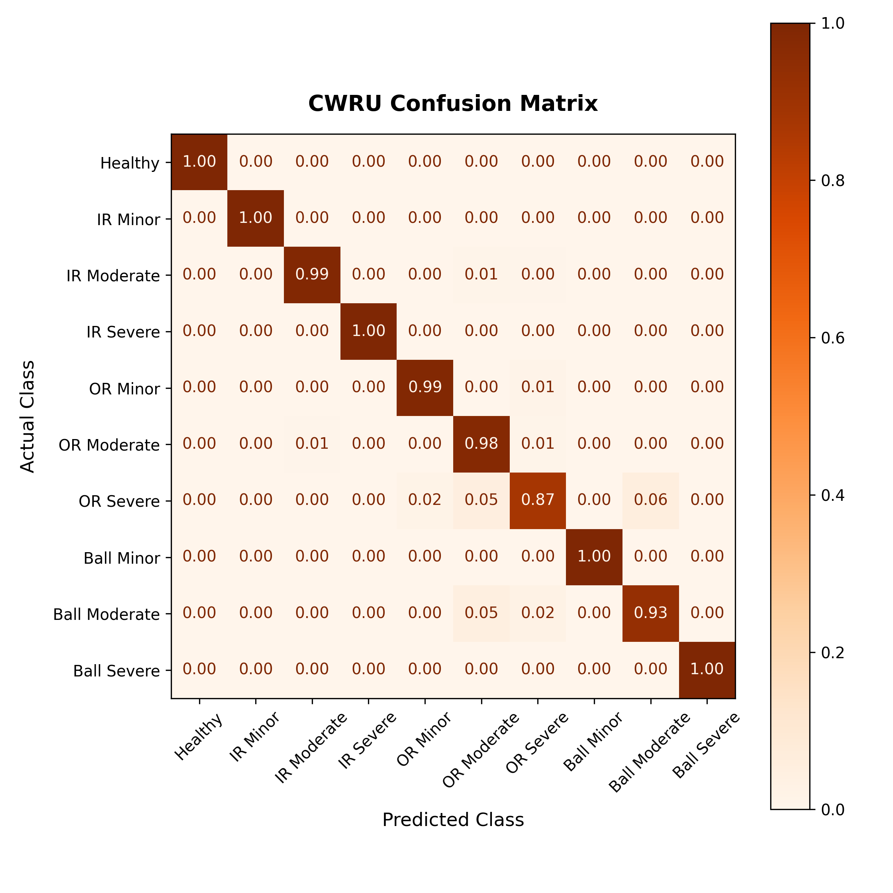

# SIMULATION-BASED PREDICTIVE MAINTENANCE FOR BEARING FAULT DIAGNOSIS USING FINITE ELEMENT ANALYSIS AND RANDOM FOREST CLASSIFIER

## Overview

This repository contains the core software implementation, machine learning pipeline, and data validation scripts for the project.

The system leverages data from **Finite Element Analysis (FEA)** simulations alongside physical experimental data (**CWRU Bearing Dataset**) to build a robust **Random Forest Classifier** capable of identifying and diagnosing structural bearing faults.

This README documents the __completed__ CWRU + ML components. The ANSYS simulation branch (`src/features_extract/step_01_noise_inject.py` and `src/features_extract/step02_ansys_extraction.py`) is a stub and is not yet implemented — it is tracked as future work, not part of this document.

---

## Project Structure

```text
minor.py/
├── README.md
├── data/
│   ├── mapping/
│   │   ├── class_mapping.json
│   │   └── fault_group_mapping.json
├── main.py
├── output/
│   ├── ansys_confusion_matrix.png
│   ├── ansys_f1.npy
│   ├── ansys_roc_auc_curve.png
│   ├── cwru_confusion_matrix.png
│   ├── cwru_f1.npy
│   ├── domain_tsne_plot.png
│   ├── f1_comparison_table.md
│   └── f1_comparison_table.xlsx
├── requirements.txt
├── setup_project.sh
├── src/
│   ├── features_extract/
│   │   ├── step01_noise_inject.py
│   │   ├── step02_ansys_extraction.py
│   │   ├── step03_cwru_extraction.py
│   └── ml/
│       ├── step04_preprocessing.py
│       ├── step05_training_and_evaluation.py
│       ├── step06_evaluate_ansys.py
│       └── step07_domain_comparision.py
└── utils/
    ├── utils_features.py
    └── utils_ml.py
```

> `data/raw`, `data/processed`, `data/splits`, and `model/` are generated at runtime and are gitignored — not shown above.

## Dataset & File Naming

__Source:__ CWRU Bearing Data Center, renamed per `data/mapping/fault_group_mapping.json`.

Raw `.mat` filenames follow `<FAMILY><DEFECT_SIZE>_<HP_INDEX>.mat`, mapped to the 10-class scheme as follows:

| Filename prefix | Fault Class | Class ID |
|---|---|---|
| `H_*` | Healthy | 0 |
| `IR007_*` | IR Minor | 1 |
| `IR014_*` | IR Moderate | 2 |
| `IR021_*` | IR Severe | 3 |
| `OR007_*` | OR Minor | 4 |
| `OR014_*` | OR Moderate | 5 |
| `OR021_*` | OR Severe | 6 |
| `B007_*` | Ball Minor | 7 |
| `B014_*` | Ball Moderate | 8 |
| `B021_*` | Ball Severe | 9 |

The `_0/_1/_2/_3` suffix denotes motor load (0–3 HP, RPM ≈ 1797/1772/1750/1730 respectively), used as the `hp_group` for `StratifiedGroupKFold`.

**Bearing type:** SKF 6205-2RS JEM

---

## Signal Processing Pipeline (`step03_cwru_extraction.py`)

1. **Drift removal:** 10 Hz highpass Butterworth (order 4), `sosfiltfilt`, applied to the full raw signal.
2. __Sample-rate alignment:__ Healthy signals are natively sampled at 48 kHz vs. 12 kHz for faulty signals — healthy signals are downsampled via `resample_poly` (up=1, down=4) to match 12 kHz across all classes.
3. **Fault-band highpass:** 1000 Hz highpass Butterworth (order 4), applied to the full aligned signal before segmentation (avoids edge artifacts from windowed filtering).
4. **Segmentation:** 2000-sample windows, 50% overlap.

### Envelope / characteristic-frequency features

Per segment, the Hilbert envelope is computed and its FFT is searched near BPFO, BPFI, and BSF (and their 2×/3× harmonics) within a **±5 Hz tolerance**, summing matched peaks.

---

## Feature Set (12 features per segment)

| # | Feature | Description |
|---|---|---|
| 1 | RMS | Root mean square amplitude |
| 2 | Kurtosis | Signal impulsiveness (Fisher) |
| 3 | Peak Amplitude | Max absolute amplitude |
| 4 | Standard Deviation | — |
| 5 | Dominant Frequency | Frequency bin of max FFT magnitude |
| 6 | Peak FFT Amplitude | Magnitude at dominant frequency |
| 7 | BPFO Amplitude | Envelope-FFT energy near outer-race fault frequency |
| 8 | BPFI Amplitude | Envelope-FFT energy near inner-race fault frequency |
| 9 | BSF Amplitude | Envelope-FFT energy near ball-spin frequency |
| 10 | BPFO Ratio | BPFO amp / (BPFO+BPFI+BSF amp) |
| 11 | BPFI Ratio | BPFI amp / (BPFO+BPFI+BSF amp) |
| 12 | BSF Ratio | BSF amp / (BPFO+BPFI+BSF amp) |

The BPFO, BPFI, and BSF amplitudes are calculated by summing the peak spectral energies found across their fundamental frequencies and first two harmonics (1x, 2x and 3x the target frequency).
The three ratio features disentangle **fault family** (IR/OR/Ball) from raw signal energy; the combined denominator (sum of all three characteristic amplitudes) acts as an implicit gatekeeper — near-zero for a healthy bearing, preventing noisy ratios from driving false fault predictions.

All features are Min-Max normalized (`normalize_dataset`) prior to model training.

---

## Model & Validation (`step05_training_and_evaluation.py`)

- __Classifier:__ `RandomForestClassifier` — `n_estimators=300`, `max_depth=100`, `min_samples_split=7`, `max_features=5`, `random_state=9`
- __Cross-validation:__ `StratifiedGroupKFold`, folds = number of unique `hp_group` values, grouped by load condition (leave-one-HP-out style evaluation)
- __Serialization:__ `joblib` → `model/random_forest_model.joblib`

### Evaluation outputs

- Row-normalized confusion matrix (`output/cwru_confusion_matrix.png`)
- Per-class F1 (`output/cwru_f1.npy`)

---

## CWRU Results

Per-class F1-score (4-fold, stratified group cross-validation):

| Fault Class | F1-Score |
|---|---|
| Healthy | 1.000 |
| IR Minor | 0.982 |
| IR Moderate | 0.914 |
| IR Severe | 0.930 |
| OR Minor | 0.988 |
| OR Moderate | 0.910 |
| OR Severe | 0.923 |
| Ball Minor | 0.975 |
| Ball Moderate | 0.911 |
| Ball Severe | 0.934 |

**Pattern:** Healthy is perfectly separated; every *Moderate*-severity class (IR, OR, Ball) sits at the bottom of the ranking (~0.91), consistently lower than its corresponding Minor and Severe neighbors. This is physically consistent — Moderate severity sits at the transition boundary between Minor and Severe defect sizes, so it's most prone to spectral overlap with its immediate neighbors on either side.



---

## Dependencies

See [`requirements.txt`](requirements.txt) for pinned versions. Install with:

```bash
pip install -r requirements.txt
```

---

## Usage

```bash
source venv/bin/activate
python3 main.py
```

Runs the full pipeline: CWRU extraction → preprocessing → training/evaluation → (ANSYS evaluation and domain comparison steps will currently fail/no-op until ANSYS extraction is implemented).

---

## Status

| Component | Status |
|---|---|
| CWRU signal processing & feature extraction | Complete |
| ML pipeline (Random Forest, GroupKFold CV) | Complete |
| CWRU validation results | Complete |
| ANSYS FEA feature extraction (`02_ansys_extraction.py`) | Not completed |
| Sim-to-real cross-domain evaluation | Pending ANSYS completion |
